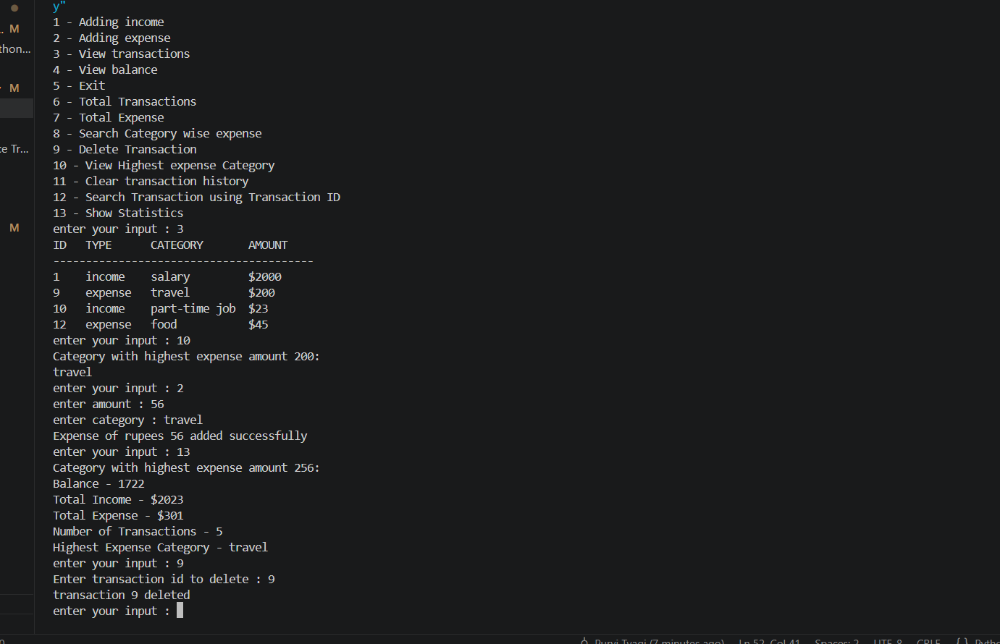

# Student Finance Tracker

A Python-based finance tracker built using Object-Oriented Programming (OOP).

## Screenshot

## Features

* Add Income
* Add Expense
* View Transactions with IDs
* View Balance
* Total Transactions
* Total Income
* Total Expenses
* Search Transactions by Category
* Delete Transactions using ID
* Highest Expense Category
* Save Transactions to File
* Load Transactions Automatically on Startup
* Input Validation and Error Handling
* View Statistics

## Technologies Used

* Python
* OOP (Classes and Objects)
* File Handling
* Dictionaries
* Git
* GitHub
* Exception Handling

## Project Structure

* `main.py` - Menu and user interaction
* `finance_tracker.py` - Business logic
* `transactions.py` - Transaction class
* `transactions.txt` - Persistent storage

## Future Improvements

* CSV support
* Monthly reports
* Expense charts
* SQLite database
* GUI version

## Author

Purvi Tyagi
